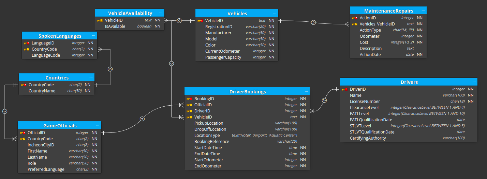

Here's a README explaining the relationships in the provided in this pictur:

---

# Database Schema Relationships Explanation

This README provides an explanation of the relationships between tables in a database schema defined in SQL. The schema includes the following tables: "Countries," "DriverBookings," "Drivers," "GameOfficials," "MaintenanceRepairs," "SpokenLanguages," "VehicleAvailability," and "Vehicles," as well as their corresponding foreign keys.

## Tables

1. **Countries**:
   - `"CountryCode"` is the primary key that uniquely identifies a country.
   - `"CountryName"` represents the name of the country.

2. **DriverBookings**:
   - `"BookingID"` is the primary key that uniquely identifies a booking.
   - `"OfficialID"` is a foreign key referencing an official's ID.
   - `"DriverID"` is a foreign key referencing a driver's ID.
   - `"VehicleID"` is a foreign key referencing a vehicle's ID.
   - `"PickupLocation"` and `"DropOffLocation"` are locations for the booking.
   - `"LocationType"` specifies the location type, which is constrained to 'Hotel,' 'Airport,' or 'Aquatic Center.'
   - `"BookingReference"` is a reference code for the booking.
   - `"StartDateTime"` and `"EndDateTime"` represent the start and end times of the booking.
   - `"StartOdometer"` and `"EndOdometer"` represent the odometer readings at the start and end of the booking.

3. **Drivers**:
   - `"DriverID"` is the primary key that uniquely identifies a driver.
   - `"Name"` is the name of the driver.
   - `"LicenseNumber"` is the driver's license number.
   - `"ClearanceLevel"` is the driver's clearance level, constrained between 1 and 4.
   - `"FATLLevel"` is a level constrained between 1 and 10.
   - `"FATLQualificationDate"` is the date of qualification for FATL.
   - `"STLVTLevel"` is a level constrained between 1 and 5.
   - `"STLVTQualificationDate"` is the date of qualification for STLVT.
   - `"CertifyingAuthority"` is the authority that certifies the driver.

4. **GameOfficials**:
   - `"OfficialID"` is the primary key that uniquely identifies an official.
   - `"CountryCode"` is a foreign key referencing a country's code.
   - `"IncheonCityID"` is an identifier for the city in Incheon.
   - `"FirstName"` and `"LastName"` are the official's first and last names.
   - `"Role"` represents the official's role.
   - `"PreferredLanguage"` represents the official's preferred language.

5. **MaintenanceRepairs**:
   - `"ActionID"` is the primary key that uniquely identifies an action.
   - `"Vehicles_VehicleID"` is a foreign key referencing a vehicle's ID.
   - `"ActionType"` specifies the type of action, constrained to 'M' (Maintenance) or 'R' (Repair).
   - `"Odometer"` represents the vehicle's odometer reading.
   - `"Cost"` is the cost of the maintenance or repair.
   - `"Description"` describes the action.
   - `"ActionDate"` is the date of the action.

6. **SpokenLanguages**:
   - `"LanguageID"` is the primary key that uniquely identifies a spoken language.
   - `"CountryCode"` is a foreign key referencing a country's code.
   - `"LanguageCode"` is an identifier for the language.

7. **VehicleAvailability**:
   - `"VehicleID"` is a foreign key referencing a vehicle's ID.
   - `"IsAvailable"` indicates whether the vehicle is available.

8. **Vehicles**:
   - `"VehicleID"` is the primary key that uniquely identifies a vehicle.
   - `"RegistrationID"` is the vehicle's registration ID.
   - `"Manufacturer"` and `"Model"` represent the vehicle's make and model.
   - `"Color"` is the color of the vehicle.
   - `"CurrentOdometer"` represents the vehicle's current odometer reading.
   - `"PassengerCapacity"` indicates the passenger capacity of the vehicle.

## Foreign Key Relationships

The following foreign key relationships exist between tables:

- "MaintenanceRepairs" table has a foreign key "Vehicles_VehicleID" that references the "VehicleID" in the "Vehicles" table, indicating the vehicle associated with a maintenance or repair action.
- "SpokenLanguages" table has a foreign key "CountryCode" that references the "CountryCode" in the "Countries" table, indicating the country where a language is spoken.
- "GameOfficials" table has a foreign key "CountryCode" that references the "CountryCode" in the "Countries" table, indicating the country associated with a game official.
- "DriverBookings" table has foreign keys "OfficialID," "DriverID," and "VehicleID" that reference the respective IDs in the "GameOfficials," "Drivers," and "Vehicles" tables, indicating the officials, drivers, and vehicles involved in a booking.
- "VehicleAvailability" table has a foreign key "VehicleID" that references the "VehicleID" in the "Vehicles" table, indicating the vehicle's availability status.

These relationships establish connections between different tables in the database, allowing for data retrieval and manipulation across related entities.

